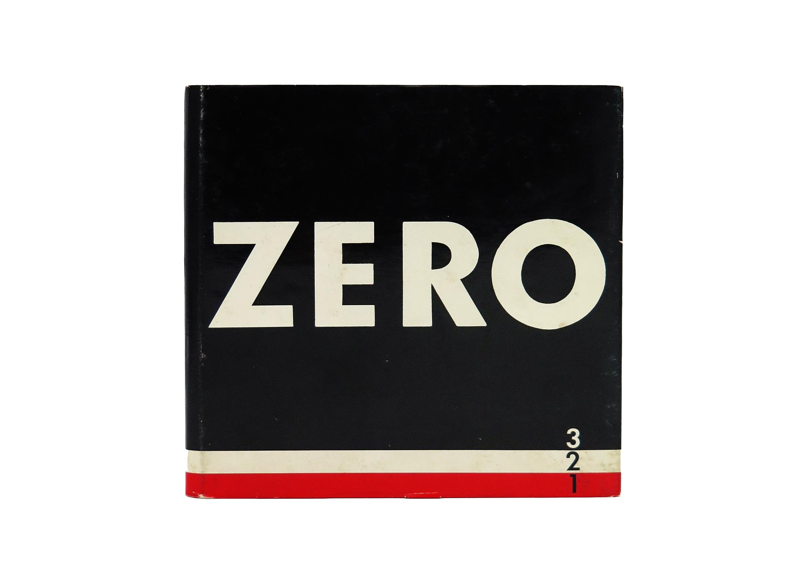

# Timewave Zero.nix

A Nix-based factory for creating and managing heterogeneous blockchain environments.



## Overview

Timewave Zero.nix is a toolkit that simplifies the deployment and management of heterogeneous blockchain networks. It supports both Cosmos-based chains and Ethereum nodes within the same infrastructure, leveraging the Nix ecosystem to provide reproducible, declarative configurations for various blockchain types, smart contract deployment, and cross-chain communication.

The project is available on GitHub at [https://github.com/timewave-computer/zero.nix](https://github.com/timewave-computer/zero.nix).

## Features

- **Multi-Blockchain Support**: Deploy and manage different types of blockchains in a unified environment
- **Cosmos Node Deployment**: Easily configure and deploy Cosmos blockchain nodes
- **Ethereum Node Deployment**: Set up local Ethereum development nodes using Foundry's Anvil
- **Smart Contract Management**: Automated tools for uploading and instantiating contracts on different chains
- **IBC Relayer Support**: Built-in support for Hermes IBC relayer configuration and inter-chain communication
- **Valence Contracts Integration**: Special support for Valence program contracts
- **NixOS Integration**: Fully integrates with NixOS modules for system-level configuration
- **ZK Simulation Environment**: Used for the zk-sim environment (configuration in [timewave-computer/infra](https://github.com/timewave-computer/infra))

## Architecture

The project is organized into several key components supporting heterogeneous blockchains:

### 1. NixOS Modules

Located in the `nixosModules/` directory:

- **cosmos-node**: Creates and configures Cosmos blockchain nodes with customizable settings
- **hermes**: Sets up and configures the Hermes IBC relayer for inter-chain communication
- **ethereum-node**: Configures and deploys Ethereum nodes using Foundry's Anvil

### 2. Flake Modules

Located in the `flakeModules/` directory:

- **upload-contracts**: Provides tools to manage the uploading and instantiation of CosmWasm contracts
- **valence-contracts**: Specialized tooling for Valence program contracts compilation and deployment
- **ethereum-contracts**: Tools for deploying and verifying Solidity smart contracts

### 3. Packages

Located in the `packages/` directory:

- **upload-contract**: CLI tool for uploading and instantiating CosmWasm smart contracts
- **ethereum-tools**: Wrappers for Foundry tools (forge, anvil, cast, chisel)

## Getting Started

### Prerequisites

- [Nix package manager](https://nixos.org/download.html) with flakes enabled

### Basic Usage

1. **Import the flake in your project**:

```nix
{
  inputs = {
    nixpkgs.url = "github:nixos/nixpkgs";
    zero-nix.url = "github:timewave-computer/zero.nix";
  };
}
```

### Cosmos Configuration

2. **Define a Cosmos Node**:

```nix
{
  services.cosmos.nodes.mynode = {
    chain-id = "my-cosmos-chain-1";
    denom = "mycoin";
    command = "gaiad";
    moniker = "My Cosmos Node";
    # More node configuration...
  };
}
```

3. **Configure IBC with Hermes**:

```nix
{
  services.cosmos.hermes.enable = true;
  # Hermes will automatically configure for all defined cosmos nodes
}
```

4. **Upload CosmWasm Contracts**:

```nix
{
  upload-contracts.chains.mynode.contracts.mycontract = {
    path = ./path/to/contract.wasm;
    instantiate = true;
    initial-state = "{}";
  };
}
```

### Ethereum Configuration

5. **Configure an Ethereum Node**:

```nix
{
  services.ethereum = {
    enable = true;
    nodes.local = {
      enable = true;
      networkId = 1337;
      port = 8545;
      host = "0.0.0.0";
      blockTime = 2; # 2 second block time
    };
  };
}
```

6. **Deploy Ethereum Smart Contracts**:

```nix
{
  ethereum-contracts = {
    rpcUrl = "http://localhost:8545";
    privateKey = "0x..."; # Your private key
    contracts.mytoken = {
      path = ./path/to/MyToken.sol/MyToken.json;
      constructorArgs = ["1000000000000000000000000"]; # 1 million tokens
      verifyContract = false;
    };
  };
}
```

## Real-World Usage Patterns

Based on the Timewave infrastructure repository, Zero.nix is used to deploy and manage complex blockchain environments with multiple chains. Here are some practical usage patterns:

### 1. Deploying Multi-Chain Test Environments

The ZK Simulation environment demonstrates how Zero.nix is used to create a test environment with multiple Cosmos chains (Gaia, Neutron, Juno, Osmosis) and configure Hermes IBC relayer for cross-chain communication.

```nix
# Example from timewave-computer/infra
{
  imports = [
    inputs.zero-nix.nixosModules.hermes
    inputs.zero-nix.nixosModules.cosmos-nodes
  ];
  
  # Example chain configuration
  services.cosmos.nodes.gaia = {
    chain-id = "sim-cosmoshub-1";
    command = "${gaia20}/bin/gaiad";
    denom = "uatom";
    bech32-prefix = "cosmos";
    minimum-gas-price.price = 0.005;
  };
  
  # Enable and configure Hermes IBC relayer
  services.cosmos.hermes.enable = true;
}
```

### 2. Standardizing Node Configurations

Zero.nix facilitates creating standardized configurations that can be applied across multiple nodes:

```nix
# Default node settings applied to all cosmos nodes
services.cosmos.nodeDefaults = {
  appSettings = {
    wasm.query_gas_limit = 100000000000000;
  };
  settings = {
    rpc = {
      cors_allowed_origins = [ "*" ];
    };
  };
};
```

### 3. Pre-Loading Smart Contracts

Zero.nix allows for pre-loading smart contracts to be deployed on chain startup:

```nix
# Pre-loading WASM contracts
services.cosmos.nodeDefaults.contracts = {
  cw_sp1_verifier-groth16.path = ./cw_sp1_verifier-groth16.wasm;
  cw_sp1_verifier-plonk.path = ./cw_sp1_verifier-plonk.wasm;
};
```

### 4. Creating Test Accounts with Funds

Zero.nix can be used to automatically create test accounts with funds:

```nix
# Creating genesis accounts with funds for testing
services.cosmos.nodeDefaults.genesisAccounts = {
  acc0.amount = "10000000000000000000000000000000000";
  faucet0.amount = "10000000000000000000000000000000000000000000000000000000000000000000";
};
```

## Advanced Configuration

### Heterogeneous Network Architecture

Zero.nix is designed to easily create and manage networks consisting of multiple blockchain technologies:

- Deploy Cosmos and Ethereum nodes side-by-side in a unified configuration
- Manage contract deployment across different blockchain platforms
- Configure chain-specific parameters while maintaining a consistent management interface

### Cosmos Node Settings

Cosmos nodes can be extensively configured with options for:
- Genesis accounts and validators
- Network interfaces and ports
- Gas pricing and transaction settings
- Custom contracts deployment

### Contract Management

The system provides fine-grained control over contract deployment:
- Automatic contract uploads
- Contract instantiation with custom initial state
- Fee estimation and gas adjustment settings

### Valence Contracts Compilation

Valence program contracts can be compiled with Rust/wasm-opt optimizations:
```nix
{
  valence-contracts.my-valence = {
    src = ./path/to/valence/project;
    contractsDir = "contracts";
  };
}
```

> **Note:** Contract build logic currently uses the original method. There are still bugs with using crate2nix that need to be resolved before it can be used to speed up builds.

### Ethereum Development

The system includes tools for Ethereum development:
- Local Ethereum node deployment using Anvil
- Smart contract deployment and verification
- Gas management and transaction configuration

## Related Projects

- [timewave-computer/infra](https://github.com/timewave-computer/infra): Contains the ZK simulation environment configuration that uses Zero.nix
- Cover image: [ZERO](https://en.wikipedia.org/wiki/Zero_(art)) was an artist group founded in late 1950s Düsseldorf by Heinz Mack and Otto Piene. The group held that creating art that was purely about the work’s materials and the world in which those materials exist, de-emphasising the role of the artist’s hand with focus was on light and space. Piene described ZERO as "a zone of silence and of pure possibilities for a new beginning."