# Architectural Overview: Zero.nix

Zero.nix is a nix-based multi-chain simulation system designed to streamline the setup and testing of blockchain environments. It provides tooling for deploying various blockchain nodes, smart contracts, and inter-chain communication mechanisms i.e. relayers.

## Core Components

### 1. NixOS Modules

The system provides NixOS modules that define how blockchain nodes and relayers are configured and deployed:

- **Cosmos Node Module** (`nixosModules/cosmos-node/`): 
  - Defines configuration options for running Cosmos SDK-based blockchain nodes
  - Handles node initialization, configuration, and service setup
  - Manages account creation, key management, and blockchain state
  - Supports contract deployment through a dedicated service

- **Hermes Relayer Module** (`nixosModules/hermes.nix`):
  - Configures and deploys the Hermes IBC relayer
  - Establishes connections and channels between blockchain networks
  - Manages key importing and chain configuration
  - Automates channel setup between all configured chains

### 2. Packages

The system includes packages for various blockchain-related tools:

- **Upload Contract Package** (`packages/upload-contract/`):
  - Provides utilities for uploading and instantiating smart contracts on Cosmos-based chains
  - Handles contract deployment workflow including storing, instantiating, and verification

- **Valence Contracts** (`packages/valence-contracts.nix`):
  - Manages specific contract packages for the Valence Protocol
  - Supports multiple contract versions (v0.1.1, v0.1.2, and main)

- **Solana Tools** (`packages/solana-tools.nix`):
  - Provides complete Solana development environment including CLI, Anchor framework, and platform tools
  - Supports SBF (Solana Berkeley Format) program compilation
  - Includes Solana CLI (v2.0.22), Anchor CLI (v0.31.1), and Platform Tools (v1.48)

### 3. Flake Modules

The flake modules extend the functionality of the system:

- **Upload Valence Contracts** (`flakeModules/upload-valence-contracts.nix`):
  - Provides specialized tooling for deploying Valence Protocol contracts
  - Integrates with the general contract upload mechanism

- **Upload Contracts Directory** (`flakeModules/upload-contracts/`):
  - Contains further utilities for contract deployment workflows

### 4. Tools

Additional tooling to support the blockchain simulation environment:

- **Build Valence Contracts** (`tools/build-valence-contracts/`):
  - Tools for building Valence Protocol contracts from source
  - Integrates with the Rust toolchain via crane and rust-overlay

### 5. Templates

Development environment templates for different blockchain platforms:

- **Solana Development** (`templates/solana-development/`):
  - Ready-to-use template for Solana development projects
  - Includes complete Solana toolchain with Anchor framework
  - Supports SBF program compilation and testing

## Architecture

```mermaid
graph TD
    %% Main Components
    ZeroNix["Zero.nix System"]
    NixModules["NixOS Modules"]
    Packages["Packages"]
    FlakeModules["Flake Modules"]
    Tools["Tools"]
    InfraRepo["Infra Repository"]
    Deployment["Blockchain Network Deployment"]
    
    %% NixOS Modules Subcomponents
    CosmosNode["Cosmos Node Module"]
    HermesModule["Hermes Relayer Module"]
    
    %% Packages Subcomponents
    UploadContract["Upload Contract Package"]
    ValenceContracts["Valence Contracts"]
    
    %% Flake Modules Subcomponents
    UploadValenceContracts["Upload Valence Contracts"]
    UploadContractsDir["Upload Contracts Directory"]
    
    %% Tools Subcomponents
    BuildValenceContracts["Build Valence Contracts"]
    
    %% External Dependencies
    CosmosNix["cosmos.nix"]
    HermesRelay["Hermes"]
    ValenceProtocol["Valence Protocol"]
    
    %% Nodes and Chains
    ChainA["Chain A (e.g. Gaia)"]
    ChainB["Chain B (e.g. Neutron)"]
    ChainC["Chain C (e.g. Osmosis)"]
    
    %% Relationships
    ZeroNix --> NixModules
    ZeroNix --> Packages
    ZeroNix --> FlakeModules
    ZeroNix --> Tools
    
    NixModules --> CosmosNode
    NixModules --> HermesModule
    
    Packages --> UploadContract
    Packages --> ValenceContracts
    
    FlakeModules --> UploadValenceContracts
    FlakeModules --> UploadContractsDir
    
    Tools --> BuildValenceContracts
    
    %% External Dependencies
    CosmosNix -.-> CosmosNode
    HermesRelay -.-> HermesModule
    ValenceProtocol -.-> ValenceContracts
    ValenceProtocol -.-> BuildValenceContracts
    
    %% Deployment Flow
    ZeroNix --> InfraRepo
    InfraRepo --> Deployment
    Deployment --> ChainA
    Deployment --> ChainB
    Deployment --> ChainC
    
    %% Inter-chain Communication
    HermesModule --> |"IBC Relayer"| ChainA
    HermesModule --> |"IBC Relayer"| ChainB
    HermesModule --> |"IBC Relayer"| ChainC
    
    %% Contract Deployment
    UploadContract --> ChainA
    UploadContract --> ChainB
    UploadContract --> ChainC
    
    %% Class Styling
    classDef core fill:#f9f,stroke:#333,stroke-width:2px
    classDef module fill:#bbf,stroke:#333,stroke-width:1px
    classDef package fill:#bfb,stroke:#333,stroke-width:1px
    classDef external fill:#ddd,stroke:#333,stroke-width:1px,stroke-dasharray: 5 5
    classDef chain fill:#feb,stroke:#333,stroke-width:1px
    
    %% Apply Classes
    class ZeroNix core
    class NixModules,Packages,FlakeModules,Tools,InfraRepo module
    class CosmosNode,HermesModule,UploadContract,ValenceContracts,UploadValenceContracts,UploadContractsDir,BuildValenceContracts package
    class CosmosNix,HermesRelay,ValenceProtocol external
    class ChainA,ChainB,ChainC chain
```



### Multi-Chain Environment

Zero.nix enables the creation of complex multi-chain testing environments by:

1. **Chain Configuration**: Allowing detailed configuration of blockchain nodes with sensible defaults 
2. **Network Topology**: Supporting the definition of inter-chain connections via IBC channels
3. **Contract Deployment**: Providing automated contract deployment and initialization across chains
4. **Message Passing**: Establishing relayer connections for cross-chain communication

### Nix Integration

The system leverages Nix/NixOS capabilities:

1. **Reproducible Environments**: Ensuring consistent test environments through declarative configuration
2. **Modular Design**: Using the flake-parts pattern for composable and reusable components
3. **Cross-Platform Support**: Supporting multiple systems (aarch64/x86_64 on Linux/Darwin)
4. **Binary Caching**: Configured with Cachix for faster setup (`timewave.cachix.org`)

### Workflow

A typical workflow in Zero.nix involves:

1. Configuring chain nodes using the cosmos-node module
2. Setting up inter-chain communication with the hermes module
3. Building smart contracts with the provided tools
4. Deploying contracts to the appropriate chains
5. Establishing channels for cross-chain message passing
6. Testing and simulating cross-chain interactions

## Integration with Infra Repository

Zero.nix is designed to be used in conjunction with a companion infrastructure repository (`infra`) that defines specific deployment configurations. The integration works as follows:

### Repository Structure and Relationship

- **zero.nix**: Core library providing modular components for blockchain simulation
- **infra**: Deployment-specific configurations that import and utilize zero.nix modules

### Integration Points

1. **NixOS Module Import**: The infra repository imports Zero.nix modules:
   ```nix
   imports = [
     inputs.zero-nix.nixosModules.hermes
     inputs.zero-nix.nixosModules.cosmos-nodes
   ];
   ```

2. **Deployment Configuration**: The infra repository uses Colmena to deploy the NixOS configurations to target machines:
   ```nix
   flake.colmenaHive = inputs.colmena.lib.makeHive self.colmena;
   ```

3. **Blockchain Node Profiles**: The infra repository defines specific blockchain configurations as profiles:
   - `profiles/gaia.nix`: Cosmos Hub configuration
   - `profiles/neutron.nix`: Neutron chain configuration
   - `profiles/juno.nix`: Juno chain configuration
   - `profiles/osmosis.nix`: Osmosis chain configuration

4. **Smart Contract Deployment**: The infra repository includes contract artifacts for deployment:
   ```nix
   services.cosmos.nodeDefaults.contracts = {
     cw_sp1_verifier-groth16.path = ./cw_sp1_verifier-groth16.wasm;
     cw_sp1_verifier-plonk.path = ./cw_sp1_verifier-plonk.wasm;
   };
   ```

### Deployment Workflow

1. **Setup Infrastructure Repository**:
   ```bash
   git clone https://github.com/timewave-computer/infra.git
   cd infra
   ```

2. **Configure Host Machine**:
   Edit or create host configuration files in the `hosts/` directory based on your requirements.

3. **Add Chain Profiles**:
   Configure the blockchain nodes you want to deploy in the `profiles/` directory.

4. **Deploy with [Colmena](https://colmena.cli.rs/)**:
   ```bash
   nix develop
   colmena apply --on zk-simulation-environment
   ```

5. **Access and Interact with Nodes**:
   Once deployed, you can interact with the blockchain nodes and relayers through their exposed RPC endpoints.

### Customization Options

1. **Adding New Chains**: Create a new profile in the `profiles/` directory following the pattern of existing profiles.

2. **Custom Contract Deployment**: Add contract WASM files to a profile directory and reference them in the configuration.

3. **Genesis Account Configuration**: Modify the `default-genesis-accounts.nix` file to configure initial account balances.

4. **Node Settings Override**: Use the `default-node-settings.nix` file to configure global settings for all nodes.

## External Dependencies

The system integrates with several external projects:

- [cosmos.nix](https://github.com/informalsystems/cosmos.nix): For Cosmos SDK blockchain node packages and utilities
- [Hermes](https://github.com/informalsystems/hermes): For IBC relayer functionality
- [Valence Protocol](https://github.com/timewave-computer/valence-protocol): For cross-chain smart contracts

## Usage Examples

Zero.nix can be used to simulate various multi-chain scenarios, such as:

- Testing cross-chain token transfers
- Validating IBC protocol implementations
- Developing and testing cross-chain applications
- Benchmarking relayer performance under different network conditions
- Simulating complex multi-chain application workflows
- Developing Solana programs with SBF compilation support
- Testing Solana smart contracts using the Anchor framework 